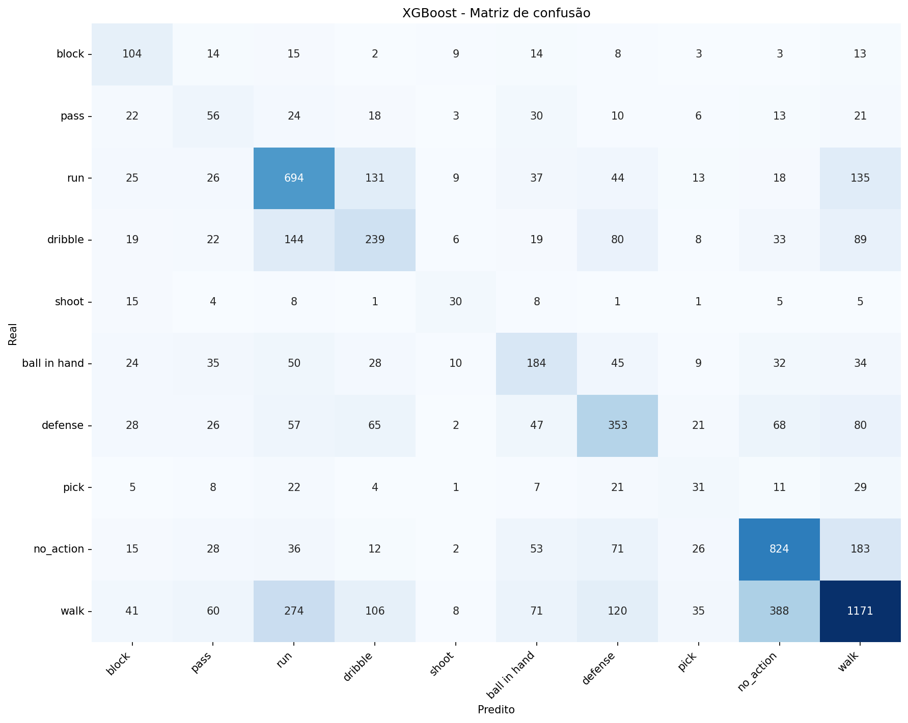
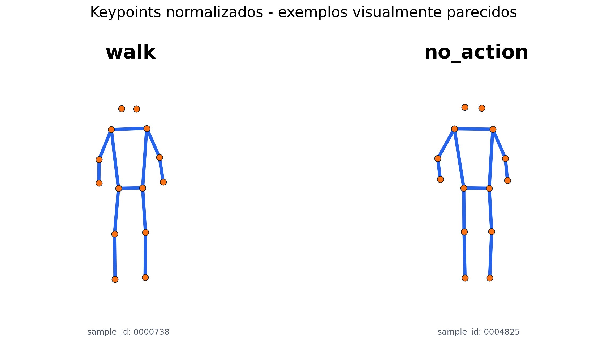
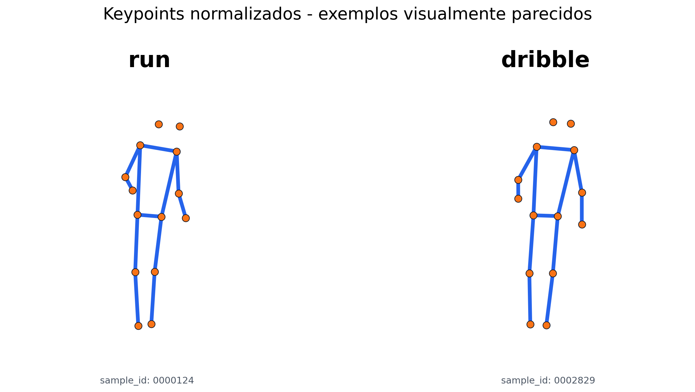
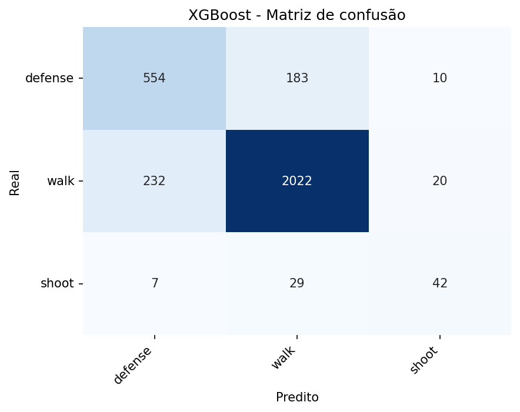
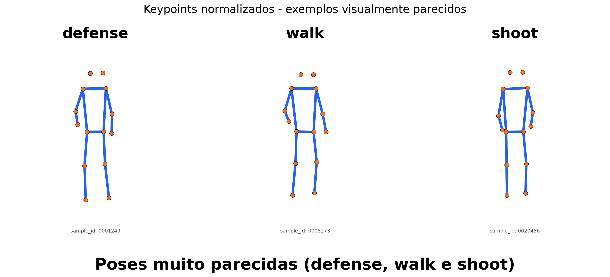
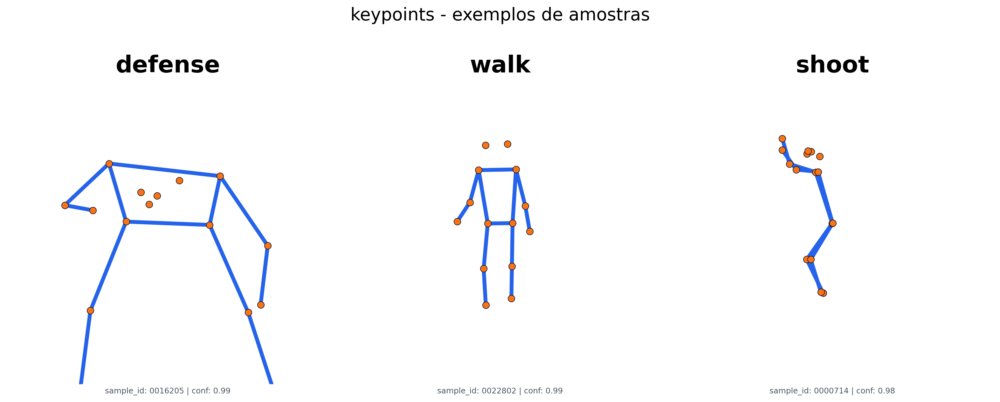

# Position Basketball ML

Projeto de classificacao de acoes de basquete a partir de keypoints corporais
extraidos com YOLO Pose.

A entrega esta organizada em dois experimentos finais:

- classificacao supervisionada com 10 classes e 80 features;
- classificacao/teste com 3 classes (`defense`, `walk`, `shoot`) e 80 features.

## Estrutura da entrega

```text
Position_Basquet_ML/
+-- README.md
+-- requirements.txt
+-- src/
|   +-- *.py
|   +-- yolo/
|   |   +-- *.py
|   +-- notebooks/
|       +-- pipeline_basketball_pose_estimation.ipynb
+-- data/
|   +-- processed/
|       +-- dataset_10_classes_80features.csv
|       +-- dataset_3_classes_80features.csv
+-- results/
    +-- feature_lists/
    |   +-- feature_audit_semantic.txt
    +-- tables/
    |   +-- classification_results_10_classes.csv
    |   +-- confusion_matriz_10_classes_xgboost.csv
    |   +-- classification_results__3_classes_defense_walk_shoot.csv
    |   +-- confusion_matrix_3_classes_defense_walk_shoot_xgboost.csv
    +-- figures/
        +-- confusion_matrices_10_classes_80_features/
        +-- confusion_matrices_3_classes_defense_walk_shoot/
        +-- keypoint_slide_examples/
```

Todos os scripts Python em `src/` e `src/yolo/` fazem parte do codigo fonte da
entrega.

## Setup

```powershell
python -m venv .venv
.\.venv\Scripts\Activate.ps1
python -m pip install --upgrade pip
pip install -r requirements.txt
```

## Notebook principal

Abra o notebook:

```powershell
jupyter notebook src\notebooks\pipeline_basketball_pose_estimation.ipynb
```

O notebook documenta o fluxo final usado na entrega:

- carregamento dos datasets finais com 80 features;
- comparacao de modelos supervisionados;
- avaliacao com acuracia, precision, recall e F1-score;
- matriz de confusao dos classificadores;
- experimento com 10 classes;
- experimento com 3 classes (`defense`, `walk`, `shoot`).

## Datasets finais

```text
data/processed/dataset_10_classes_80features.csv
data/processed/dataset_3_classes_80features.csv
```

Os dois arquivos contem as colunas de identificacao/rotulo e as 80 features
selecionadas em:

```text
results/feature_lists/feature_audit_semantic.txt
```

## Resultados finais

Tabelas principais:

```text
results/tables/classification_results_10_classes.csv
results/tables/confusion_matriz_10_classes_xgboost.csv
results/tables/classification_results__3_classes_defense_walk_shoot.csv
results/tables/confusion_matrix_3_classes_defense_walk_shoot_xgboost.csv
```

Figuras principais:

```text
results/figures/confusion_matrices_10_classes_80_features/
results/figures/confusion_matrices_3_classes_defense_walk_shoot/
results/figures/keypoint_slide_examples/
```

## Resumo dos resultados

### 10 classes com 80 features

| Modelo | Accuracy | Precision macro | Recall macro | F1 macro | ROC-AUC OVR macro |
|---|---:|---:|---:|---:|---:|
| XGBoost | 0.518 | 0.416 | 0.448 | 0.427 | 0.874 |
| SVM (SVC) | 0.480 | 0.381 | 0.451 | 0.397 | 0.865 |
| MLP | 0.453 | 0.361 | 0.430 | 0.369 | 0.846 |
| Random Forest | 0.512 | 0.579 | 0.316 | 0.339 | 0.864 |
| Logistic Regression | 0.421 | 0.336 | 0.409 | 0.337 | 0.820 |
| Decision Tree | 0.357 | 0.243 | 0.245 | 0.243 | 0.583 |

O melhor resultado geral foi do XGBoost, com `f1_macro = 0.427`. O problema com
10 classes e mais dificil porque algumas acoes possuem movimentos parecidos ou
aparecem em menor quantidade. A matriz de confusao mostra acertos mais fortes em
`run`, `walk` e `no_action`, mas tambem confusoes relevantes entre `walk`,
`run`, `dribble`, `defense` e `no_action`. A classe `shoot` tem menos exemplos e
fica mais sensivel a erros.



Exemplos de diferencas visuais entre keypoints de classes que geraram confusao:





### 3 classes com 80 features: defense, walk e shoot

| Modelo | Accuracy | Precision macro | Recall macro | F1 macro | ROC-AUC OVR macro |
|---|---:|---:|---:|---:|---:|
| XGBoost | 0.845 | 0.729 | 0.723 | 0.726 | 0.927 |
| SVM (SVC) | 0.805 | 0.627 | 0.735 | 0.664 | 0.915 |
| Random Forest | 0.833 | 0.780 | 0.573 | 0.630 | 0.913 |
| MLP | 0.768 | 0.582 | 0.752 | 0.617 | 0.884 |
| Logistic Regression | 0.768 | 0.580 | 0.749 | 0.609 | 0.886 |
| Decision Tree | 0.768 | 0.593 | 0.572 | 0.582 | 0.687 |

No recorte de 3 classes, o XGBoost tambem foi o melhor modelo, com
`f1_macro = 0.726`. O resultado melhora bastante porque as classes escolhidas
sao mais separaveis do que o problema completo de 10 classes. A principal
confusao ocorre entre `defense` e `walk`; `shoot` aparece em menor quantidade,
mas fica mais isolado nesse recorte.



Exemplos de keypoints no recorte de 3 classes:





As demais matrizes de confusao estao nas pastas de figuras listadas acima, uma
imagem por modelo.


## Modelos avaliados

```text
Logistic Regression
Decision Tree
Random Forest
XGBoost
SVM (SVC)
MLP
```

A metrica principal de comparacao e `f1_macro`, porque o dataset e
desbalanceado entre classes.
